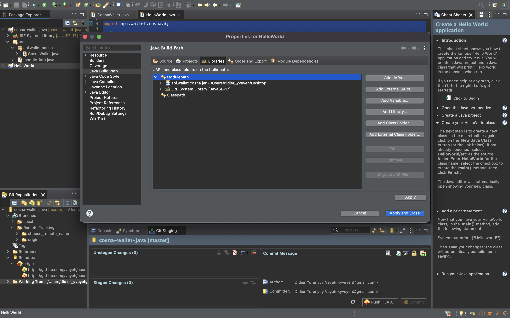

# cosna_wallet
A controller to access endpoints in the cosna wallet integration API.

## Installation
Install the cosna_wallet package as follows:

1. Download the package [here](./dist/api.wallet.cosna-1.0.0.jar).
2. Add it to your java project by configuring the build path.

    
3. Make use of the cosna_wallet as seen below.


## Usage
To use the cosna_wallet package:

```java
import api.wallet.cosna.*;

public class HelloWorld {

	/**
	 * @param args
	 */
	public static void main(String[] args) {
		
		String master_key = "master_key_yTh7mLB5eB4C1PbMOn3h348HfAAv55Y9";
    	String private_key = "private_key_6JwbGpw6ZbdM9PRoCNhEPbH7Jm6yTP7i";
    	String payload = "{\n"
    			+ "    \"amount\": 200,\n"
    			+ "    \"currency\": \"XAF\",\n"
    			+ "    \"hash\": \"85fd974423b56c15ef2d7ad6e25d9b98\",\n"
    			+ "    \"return_url\": \"https://www.fb.com\",\n"
    			+ "    \"cancel_url\": \"https://www.yt.com\",\n"
    			+ "    \"callback_url\": \"https://beta.cosna-afrique.com\"\n"
    			+ "}";

    	CosnaWallet wallet = new CosnaWallet(master_key, private_key);
    	
    	try {
			System.out.println(wallet.init_payment(payload, "/wallet/payment"));
		} catch (Exception e) {
			e.printStackTrace();
		}
	}

}
```